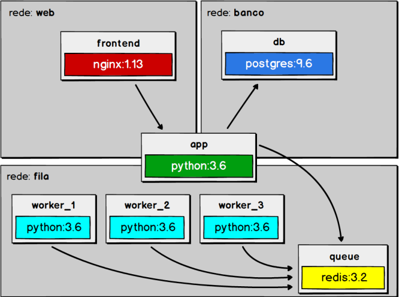

# Email-com-workers
Email com Workers - Projeto final do curso Docker: Ferramenta essencial para Desenvolvedores - Udemy

## Resumo
Solução com docker de um sisteminha que cadastra uma fila de emails a serem enviados. 

Obs: Não foi feita a implementação propriamente dita do envio do -email

## Arquitetura
<p align="center">
  
</p>

## Como Rodar
1. Ter o Docker instalado
2. Clonar o Repositório
3. Na pasta do projeto rodar o comando ```docker-compose up -d --scale worker=3```
4. O docker irá escalar o service worker com 3 containers
5. Acessar http:localhost e enviar dados pelo formulário
6. Acompanhar os logs dos workers
 


